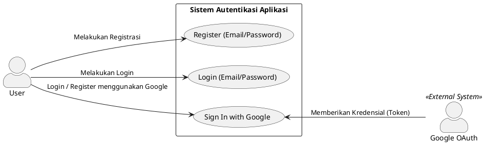

# Use Case Diagram - Login & Register

Berikut adalah PlantUML Use Case Diagram untuk proses Login dan Register dengan melibatkan actor **User** dan eksternal provider **Google OAuth**:

**Penjelasan Singkat:**
- **User (Aktor Utama)**: Aktor yang melakukan interaksi langsung dengan aplikasi. Ia dapat memicu aksi untuk login tradisional, registrasi tradisional, maupun menggunakan Google OAuth.
- **Google OAuth (Aktor Eksternal)**: Merupakan pihak ketiga yang dilibatkan pada use case *Sign In with Google*. Aktor ini berperan memvalidasi user yang mencoba login menggunakan akun Google dan merespons dengan memberikan kredensial (Token/Data OAuth) agar pengguna bisa diloloskan untuk masuk ke aplikasi.
- **Batasan Sistem (Rectangle)**: Merepresentasikan lingkup fungsionalitas dari sistem autentikasi di platform Anda.
